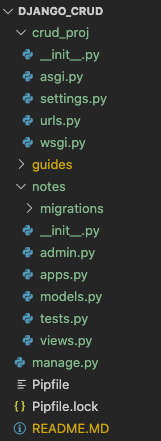
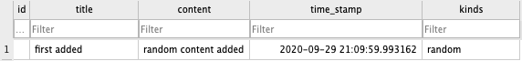

#### Environment Setup

1) Create virtual environment using `pipenv`

   - using `--three` lets pipenv know to use Python3

    ~~~ bash
    pipenv --three
    ~~~

2) Activate the virtual environment

    - enter `exit` to leave the virtual environment

    ~~~ bash
    pipenv shell
    ~~~

3) While in the virtual environment, install `django`

    ~~~ bash
    pipenv install django
    ~~~

4) Create the project. Make sure to use the `.` to help with migration to Heroku later. The `.` will create the project folder directly in the root instead of creating its own project folder and then creating a project folder of the the same name within.

    ~~~ bash
    django-admin startproject crud_proj .
    ~~~

5) Create an app called notes

    ~~~ bash
    django-admin startapp notes
    ~~~

6) The project layout should resemble the following:

    

7) Change directories to the root folder and launch the server
    - `Control + C stops the server`

    ~~~ bash
    ./manage.py runserver
    ~~~

8) At this point, no migrations have been run and Django will present warnings when running the server. To view the migrations that need to be run:

    ~~~ bash
    ./manage.py showmigrations
    ~~~

    - the following should show up:

    ~~~ bash 
    admin
    [ ] 0001_initial
    [ ] 0002_logentry_remove_auto_add
    [ ] 0003_logentry_add_action_flag_choices
    auth
    [ ] 0001_initial
    [ ] 0002_alter_permission_name_max_length
    [ ] 0003_alter_user_email_max_length
    [ ] 0004_alter_user_username_opts
    [ ] 0005_alter_user_last_login_null
    [ ] 0006_require_contenttypes_0002
    [ ] 0007_alter_validators_add_error_messages
    [ ] 0008_alter_user_username_max_length
    [ ] 0009_alter_user_last_name_max_length
    [ ] 0010_alter_group_name_max_length
    [ ] 0011_update_proxy_permissions
    [ ] 0012_alter_user_first_name_max_length
    contenttypes
    [ ] 0001_initial
    [ ] 0002_remove_content_type_name
    sessions
    [ ] 0001_initial
    ~~~

    - To see what individual SQL queries will be run, use the following syntax:

    ~~~ bash
    ./manage.py sqlmigrate [package_name] [migration_id]
    ~~~

    - for example(a long string of SQL commands will be displayed):
    ~~~ bash
    ./manage.py sqlmigrate auth 0003
    ~~~

9) Run the first migration

    ~~~ bash
    ./manage.py migrate
    ~~~

    - running `./manage.py showmigrations` will show everything that was run along with a check beside it

    ~~~ bash
    admin
    [X] 0001_initial
    [X] 0002_logentry_remove_auto_add
    [X] 0003_logentry_add_action_flag_choices
    auth
    [X] 0001_initial
    [X] 0002_alter_permission_name_max_length
    [X] 0003_alter_user_email_max_length
    [X] 0004_alter_user_username_opts
    [X] 0005_alter_user_last_login_null
    [X] 0006_require_contenttypes_0002
    [X] 0007_alter_validators_add_error_messages
    [X] 0008_alter_user_username_max_length
    [X] 0009_alter_user_last_name_max_length
    [X] 0010_alter_group_name_max_length
    [X] 0011_update_proxy_permissions
    [X] 0012_alter_user_first_name_max_length
    contenttypes
    [X] 0001_initial
    [X] 0002_remove_content_type_name
    sessions
    [X] 0001_initial
    ~~~

#### Project Models
- Each model should map to a single table in the database
- The attributes of the model relate to a database field 
- Although `Django` adds an `id` field automatically as  `id = models.AutoField(primary_key=True)`. However, a custom id field can be defined
- Every model MUST have one field that contains `primary_key = True`

1) Add the following to the app's `models.py`

    ~~~ py
    from django.db import models
    from django.utils import timezone     # required for adding timestamp info
    from uuid import uuid4  # required for custom id using UUIDs

    # Create your models here.
    class Note(models.Model):

        NOTES_KINDS = (
            ('random', 'RANDOM'),
            ('important', 'IMPORTANT'),
            ('misc', 'MISC'),
        )

        id = models.UUIDField( primary_key = True, default = uuid4, editable = False)
        title = models.CharField(max_length = 100)
        content = models.TextField(blank = True) # allowed to be blank
        time_stamp = models.DateTimeField(default = timezone.now)
        kinds = models.CharField(max_length=50, choices = NOTES_KINDS, default = 'misc')

        def __str__(self):
            return self.title
    ~~~

2) Activate the app by adding it to the project's `settings.py` file

    ~~~ py
    INSTALLED_APPS = [
        'notes.apps.NotesConfig',
        'django.contrib.admin',
    ~~~

3) Verify the status of the migrations

   - `showmigrations` just lists the status of proejct's migrations
   - `makemigrations` prepares migrations from changes to the models
   - `migrate` runs the actual migration

    ~~~ bash
    ./manage.py showmigrations
    ~~~

    - should show the following:~~~

        ~~~ bash
        notes
        (no migrations)
        ~~~

    ~~~ bash
    ./manage.py makemigrations
    ~~~

    - should show the following:

        ~~~ bash
        Migrations for 'notes':
        notes/migrations/0001_initial.py
        - Create model Note 
        ~~~

    ~~~ bash
    ./manage.py migrate
    ~~~

    - should now show:

        ~~~ bash
        Migrations for 'notes':
        notes/migrations/0001_initial.py
            - Create model Note
        (django_crud) bash-3.2$ ./manage.py migrate
        Operations to perform:
        Apply all migrations: admin, auth, contenttypes, notes, sessions
        Running migrations:
        Applying notes.0001_initial... OK
        ~~~

#### Manually adding data via Python Shell

1) Launch the `Python Shell`

   - the prompt should turn into >>>
   - load objects, imports, etc. into the shell before attempting to use

    ~~~ bash
    ./manage.py shell
    ~~~

3) Load the notes class and add an item 

    ~~~ bash 
    from notes.models import Note
    n = Note(title = "first added", content = "random content added", kinds = 'random')
    ~~~

4) Test that the iem has proper syntax

    ~~~ bash
    n
    ~~~

    - should show:

    ~~~ bash
    <Note: first added>
    ~~~

5) Save the item to the database    

    ~~~ bash
    n.save()
    ~~~

    - the database should show the added item

        

6) Run a `QuerySet` to see the added object

    ~~~ bash
    Note.objects.all()
    ~~~

    - should show:

        ~~~ bash
        <QuerySet [<Note: first added>]>
        ~~~

7) Exit `Python Shell`

    ~~~ bash
    exit()
    ~~~

#### Setting up the SECRET_KEY in .env

1) Create a new key in the `Python Shell` by running the following all from one line

    ~~~ bash
    import random
    ''.join([random.SystemRandom().choice('abcdefghijklmnopqrstuvwxyz0123456789!@#$%^&*(-_=+)') for i in range(50)])
    ~~~

2) Save this key in the `.env` file as (create this file if necessary)

    ~~~ bash
    SECRET_KEY = 'whatever_new_key_just_created'
    DEBUG=True
    ~~~

3) While in the virtual environment, run 

    ~~~ py
    pipenv install python-decouple
    ~~~

4) Add the following to the top of the project's `settings.py` to import the config object

    ~~~ bash
    from decouple import config
    ~~~

    then change the line that held the original `SECRET_KEY` to:

    ~~~ bash
    SECRET_KEY = config('SECRET_KEY')
    ~~~

    and then change the original DEBUG

    ~~~ bash
    DEBUG = config('DEBUG', default=False, cast=bool)
    ~~~

